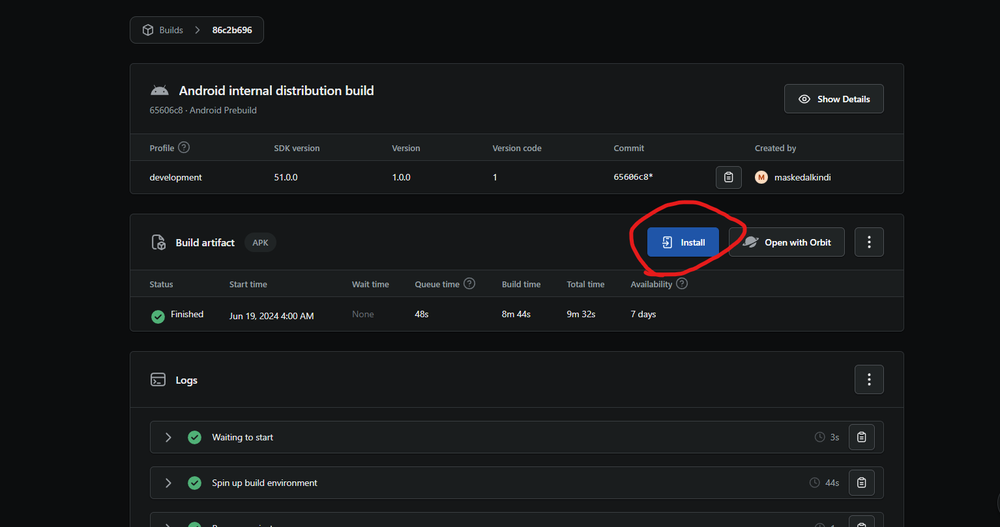
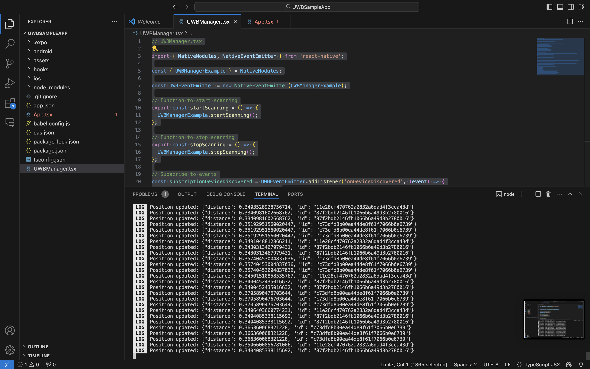
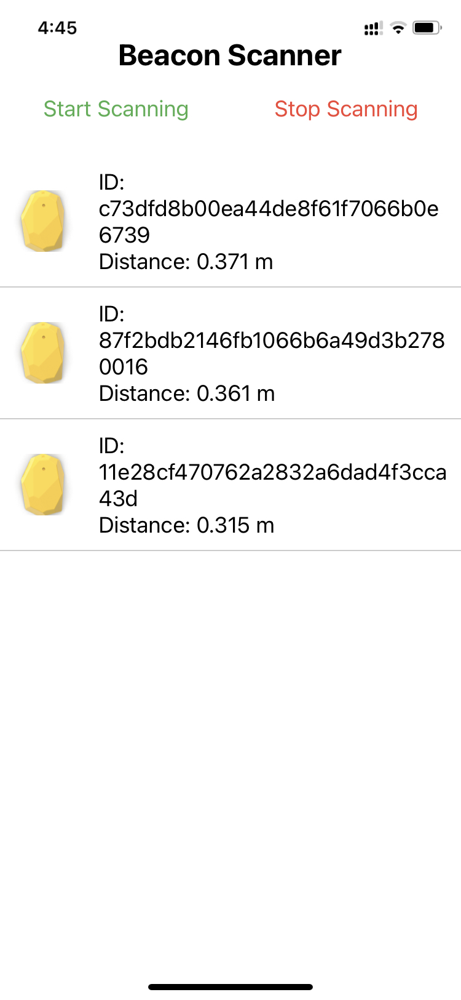

# Estimote UWB SDK for React Native

Welcome to the GitHub repository for the Estimote UWB SDK adapted for React Native. This repository hosts a sample Expo application that bridges the latest Estimote UWB beacon SDK with React Native, facilitating easy development and integration.

# This Project
## Supported Platforms

| Platform       | Supported       |
| -------------- | --------------- |
| 🍎 Apple       | ✅              |
| 🤖 Android     | ✅              |


## Tested Platforms

| Platform       | Tested       |
| -------------- | --------------- |
| 🍎 Apple       | ✅              |
| 🤖 Android     | ❌              |


### Platform Compatibility Note
The Android version was not tested due to limitations in UWB technology support. Unfortunately, I did not have access to an Android device that supports UWB technology. However, I was able to test on the latest compatible Apple device, the iPhone 11.

According to the official iOS UWB SDK Documentation regarding compatible Apple devices:

"UWB-enabled iPhones *(iPhone 11 to iPhone 14 with U1 chip or iPhone 15 and newer with 2nd-gen UWB chip).* It leverages the Core Bluetooth API and the Nearby Interactions API to discover, connect to, and range between UWB-enabled iPhones and beacons."


## Getting Started
This project uses Expo's prebuild configuration. To get started, you need to have an account on [Expo](https://expo.dev).

### Installation Instructions

1. **Install dependencies:**
   ```bash
   npm install
   ```

2. **Update bundle identifiers in `app.json`:**
   ```json
   "ios": {
     "supportsTablet": true,
     "bundleIdentifier": "com.UWBSampleApp.appy"
   },
   "android": {
     "adaptiveIcon": {
       "foregroundImage": "./assets/adaptive-icon.png",
       "backgroundColor": "#ffffff"
     },
     "package": "com.UWBSampleApp.appy"
   }
   ```

   **Note for iOS:** You are required to have an Apple Developer Account and to register the identifier in the Apple Developer Portal.

3. **Create a development build with Expo Application Services (EAS):**
   - For Android:
     ```bash
     eas build --profile development --platform android
     ```
   - For iOS:
     ```bash
     eas build --profile development --platform ios
     ```
     Note: You might encounter a dependency conflict with CocoaPods. To resolve this, use Xcode for building. Navigate to the iOS directory, run `pod install`, and if needed, fix dependency names with:
     ```bash
     grep -rl "s.dependency 'React/Core'" node_modules/ | xargs sed -i '' 's=React/Core=React-Core=g'
     ```

4. **Launch the application:**
   - Open the `.xcworkspace` in Xcode, connect your Apple device, and adjust the development team and bundle identifier settings in Signing & Capabilities.
   - After installing the build on your device, open a terminal and run:
     ```bash
     npx expo start
     ```
   - Scan the QR code within your build to start the application.

   For Android, the procedure is similar post-build creation. Visit [Expo Dev](https://expo.dev) to download your development build, run the above command in your terminal or Command Prompt, and scan the QR code to launch the app.
   


5. **Data and Reading UWB Beacons:**
- After the application has launched, you will see data about nearby UWB beacons in the terminal.




## Application UI in Action 





## For further development or Tweaking of Bridged SDK you can edit the scripts directory 

## IOS

Once you open the project in xcode using the steps i have provided you can edit UWBManager.swfit which contain the functions that were bridged.


## Android

Go to android\app\src\main\java\com\uwbsampleapp\appy\UWBModule.kt and you can view the bridged functions there and you can tweak them as you like.


## About Estimote UWB Beacons
Estimote UWB beacons are known for their precise positioning capabilities. This is the first integration of UWB beacons with React Native to my knowledge. Although the SDK provides good features, it currently has a few limitations, such as the lack of beacon authentication and the issue of having alot of devices not support UWB, which makes the use cases limited.

For more details and updates on the SDK, visit Estimote's GitHub pages:
- [Android Estimote UWB SDK](https://github.com/Estimote/Android-Estimote-UWB-SDK)
- [iOS Estimote UWB SDK](https://github.com/Estimote/iOS-Estimote-UWB-SDK)

You can also find the latest sample apps for native Android and iOS development on these pages.

## Contributions
Contributions to this project are welcome. Feel free to utilize this application or the GitHub repository as outlined under the MIT License.


## Special thanks 

Special thanks to Miss Nusaiba Al Sulaimani Lecturer in the German University of Technology in Oman for providing the opportunity to work on this project and for allowing the use of the UWB Beacons for development.


